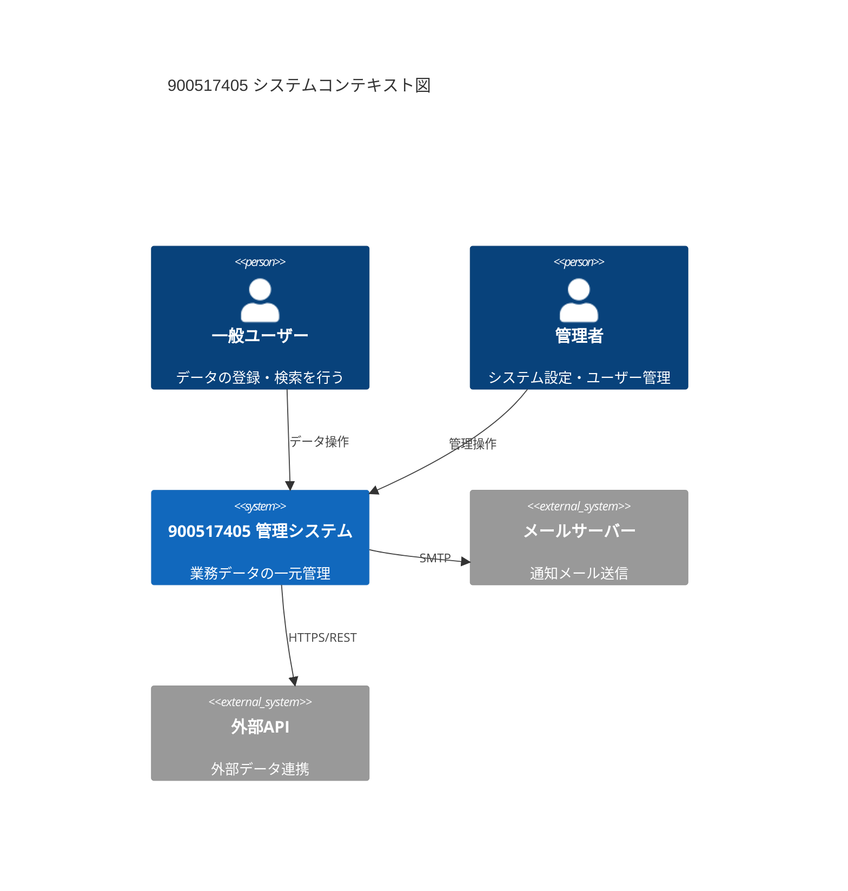

# システムコンテキスト図

```mermaid
C4Context
    title 900517405 システムコンテキスト図

    Person(user, "一般ユーザー", "データの登録・検索を行う")
    Person(admin, "管理者", "システム設定・ユーザー管理")

    System(system, "900517405 管理システム", "業務データの一元管理")

    System_Ext(mail, "メールサーバー", "通知メール送信")
    System_Ext(extapi, "外部API", "外部データ連携")

    Rel(user, system, "データ操作")
    Rel(admin, system, "管理操作")
    Rel(system, mail, "SMTP")
    Rel(system, extapi, "HTTPS/REST")
```
